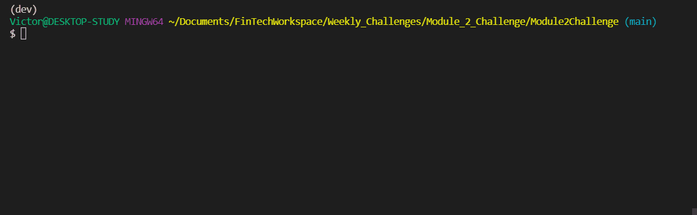

# Loan Qualifier

This program can be used to determine the loans that the applicant is qualified for based on a number of factors. These factors can include the applicant's credit score, monthly debt, monthly income, desired loan amount, among others. A list of qualifying lenders will be provided based on the info above.

---
<br>

## Technologies

This program uses the following packages:
* Python - v.3.8
* Fire - v.0.4.0
* Questionary - v.1.10.0

---
<br>

## Installation Guide

* Install [Anaconda](https://www.anaconda.com/). This will install all necessary packages and the Python programming language that is used by this program.

* Install the following packages using pip:
```
pip install fire
pip install questionary
```

---
<br>

## Usage

* Open up the Anaconda terminal and nagivate to the folder where this file is located.

* Run the program using the following command:
```
python app.py
```

* Example usage:

